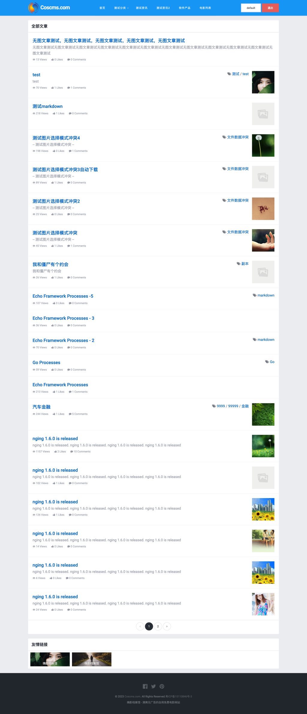
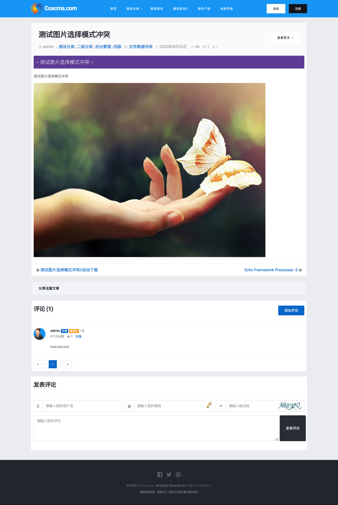
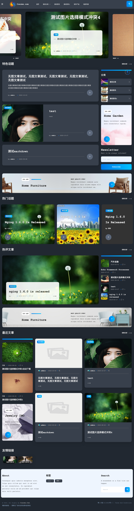
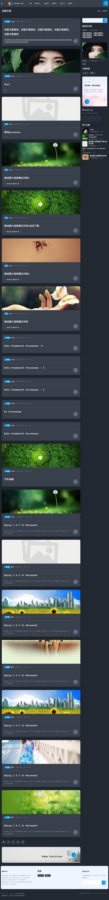
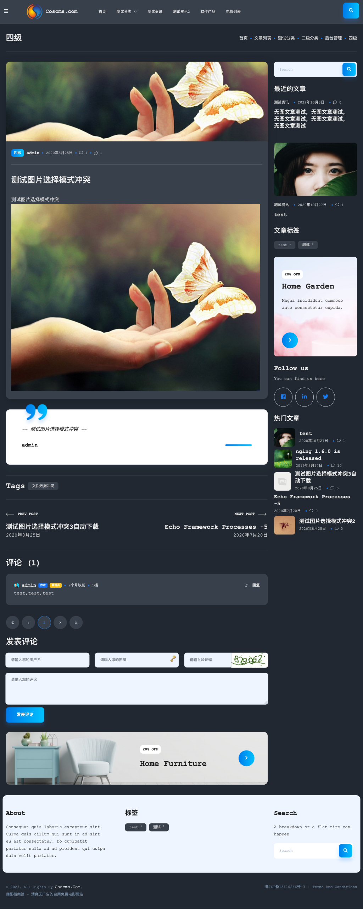

# webx

Article system and blog system in Go.

This is a general-purpose frontend foundation project for websites, based on the backend management project [Nging](https://github.com/admpub/nging).

This project serves as the core foundational code for website projects and only includes general basic features.

To develop specific production-level projects, you need to create a separate repository and import this project.

Overall, it works like building blocks. Different projects are composed of different "blocks," allowing you to add your own new features independently without affecting other code.

[New Project] `<-import-` [webx] `<-import-` [nging]

## Features

1. Frontend member login & registration  
2. Frontend member center
3. Frontend member management
4. Article management (supports paid reading)
5. Comment management
6. Category management
7. User wallet (supports extending different assets)
8. Short link functionality
9. Third-party login
10. SMS & Email verification
11. Supports online template switching and template content modification
12. Supports custom URLs (TODO)

### VIP Features

1. Open Platform:
    1. Short link creation API
    2. Payment gateway
    3. OAuth2 third-party login API
    4. OAuth2 server local service

2. Online Payments (PayPal, Alipay, WeChat Pay (untested), PayJS (untested), Hupijiao Pay)

## Conventions

To support bindata, the following conventions must be observed:

1. File names in the `public/assets` directory cannot be the same as those in the `public/assets` directory of the nging project.

2. File names in the `template` directory cannot be the same as those in the `template` directory of the nging project.

Because when this project is packaged using bindata, files in the `public/assets` and `template` directories of this project will be merged with those in the nging project. If there are files with the same name, only one will take effect.

## About Domains
 
This system uses `github.com/webx-top/echo/subdomains` to start frontend and backend applications. You can refer to its code for detailed implementation.

Specify the domain for the `backend` or `frontend` by setting the `backend.domain` or `frontend.domain` parameters at startup.

(Here, `backend` and `frontend` both refer to backend applications implemented in Go.)

Usually, we only need to specify `backend.domain`:

```
./webx -p 9999 --backend.domain="backend.webx.top,127.0.0.1:9999"
```

This achieves the effect where `the backend can only be accessed via the specified domain, while all other domains point to the frontend`.

At this point, the first domain will automatically be used as the URL within the backend pages (you can specify a different domain by setting the "Backend URL" in the admin panel. Of course, this different domain must be reverse-proxied to one of the specified domains above to be accessible).

If only the frontend is specified (very rare cases):

```
./webx -p 9999 --frontend.domain="www.webx.top,127.0.0.1:9999"
```
The effect is reversed: `the frontend can only be accessed via the specified domain, while all other domains point to the backend`.

Similarly, the first domain will automatically be used as the URL within the frontend pages (the modification method is similar to the backend above, except you need to set the "Frontend URL").

### Using the Same Domain for Frontend and Backend
When `--frontend.domain` and `--backend.domain` parameters are not provided at startup, you can use the same domain (or IP and port) plus the `/admin` path to access the backend.

You can set the backend access path to a different path before startup by configuring the `NGING_BACKEND_URL_PREFIX` environment variable, for example:
```
NGING_BACKEND_URL_PREFIX=/administrator
```

## Development Notes
1. Before development, initialize the data in the MySQL database
    * First, run the command `go mod tidy` to fetch dependencies.
    * Then, start the program following step 2 below.
    * Visit `http://127.0.0.1:8181/setup` in your browser, enter MySQL database information, set up the admin account, and proceed with the installation.

2. Startup steps during development

    Run `sudo ./run.sh` (if it's the first time, run `sudo ./run_first_time.sh` instead).

3. Steps to modify database table structures

    First, directly modify the table structure in the database, then navigate to this project's `tool` folder via the `cd tool` command, and run `./gen_dbschema.sh` to regenerate the table structure models.
    > If the password is not `root`, remember to first change `root` in the `./gen_dbschema.sh` script to your database password.

    Then, modify the `dbschema` constant value in the `./application/version/dbschema.go` file. Typically, add `+0.1` to the original value. Whenever the table structure changes, this value must be updated before releasing a new version, so the program can automatically update the database schema for older versions based on this version number.

4. Software compilation and release steps
    * First, run the `go mod vendor` command to sync all dependencies into the current project's `vendor` folder, because the `go-bindata` program copies static files from the `vendor` folder when embedding them;
    * Then, navigate to this project's `tool` folder via the `cd tool` command, and run `./build-linux64.sh` to compile and create the archive. The compiled archive will be located in the `<Project Root>/dist` folder.

## Screenshots

### Article Template (Default)

* List Page


* Detail Page


### Blog Template - Dark Mode (Supports Dark and Light Modes)

* Home Page



* List Page


* Detail Page

