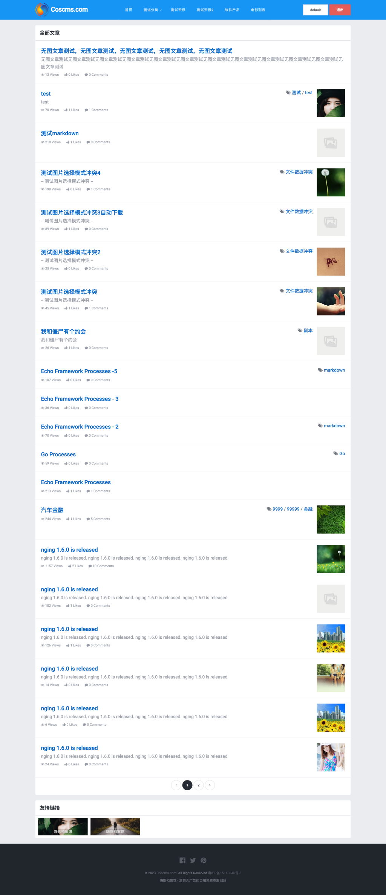
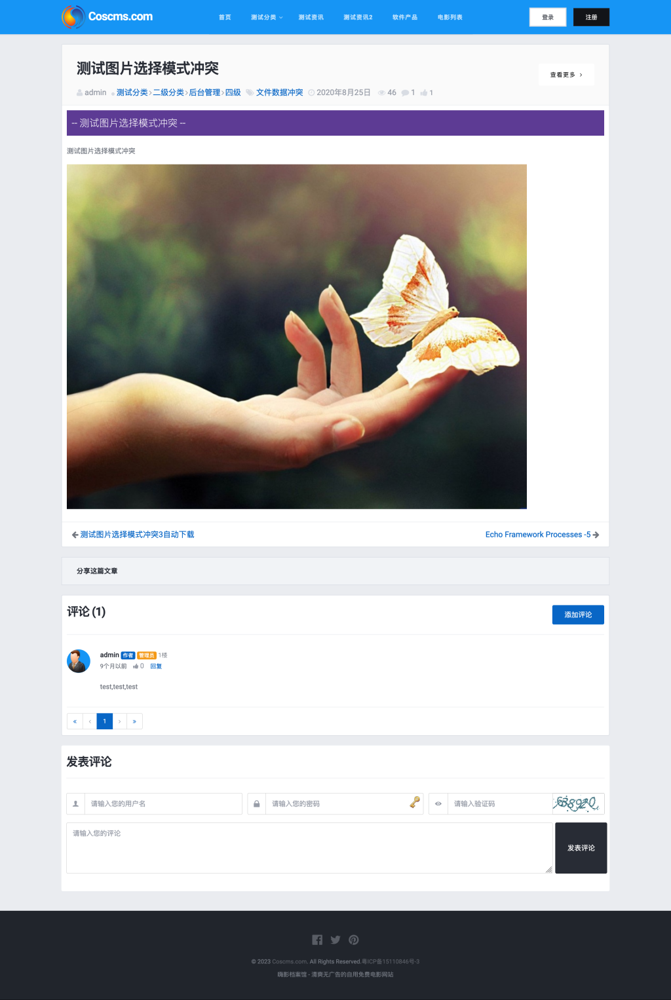
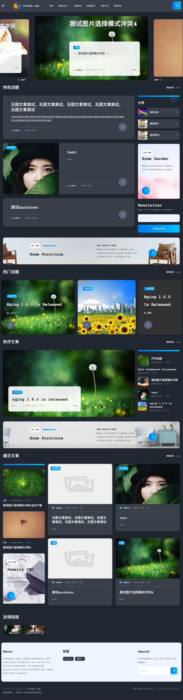
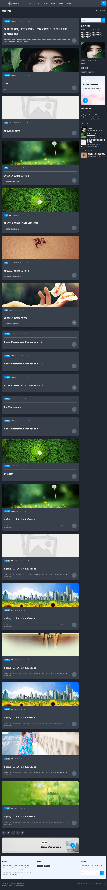
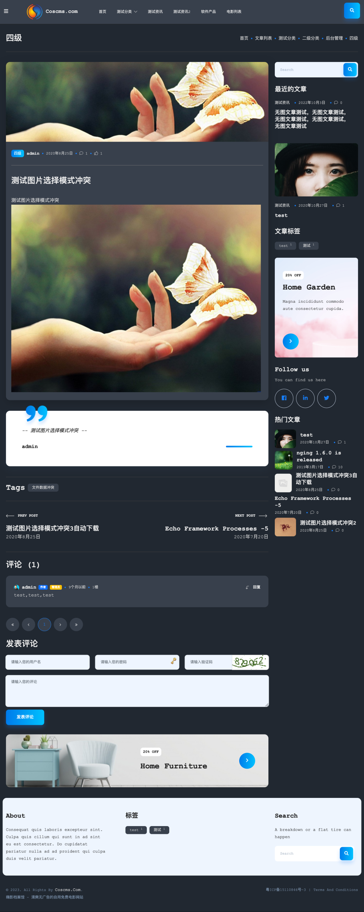

# webx

Go语言文章系统、博客系统。

这是一个网站通用前台基础项目，基于后台管理项目[Nging](https://github.com/admpub/nging)。

本项目作为网站项目基础核心代码，仅仅包含通用的基础功能。

开发具体的产品级项目，需要另开项目仓库，并用import引入本项目。

整体上就像搭积木一样，不同的项目由不同的“积木”进行组合，并单独增加自己的新功能而不影响其它代码。

[新项目] `<-import-` [webx] `<-import-` [nging]

## 功能特性

1. 前台会员登录、注册  

2. 前台会员中心

3. 前台会员管理

4. 文章管理（支持付费阅读）

5. 评论管理

6. 分类管理

7. 用户钱包 (支持扩展不同资产)

8. 短链接功能

9. 第三方登录

10. 短信、E-mail认证

11. 支持在线切换模板和修改模板内容

12. 支持网址自定义(TODO)

### VIP功能

1. 开放平台：

    1. 短链接创建接口
    2. 支付网关
    3. oauth2第三方登录接口
    4. oauth2 server本地服务

2. 在线支付(Paypal、支付宝、微信支付(未测试)、PayJS(未测试)、虎皮椒支付)

## 约定

为了支持bindata，需要遵守以下约定：

1. public/assets 目录下的文件名不能与nging项目里public/assets目录下的相同

2. template 目录下的文件名不能与nging项目里template目录下的相同

因为本项目在使用bindata打包的时候会将本项目中public/assets和template这两个目录下的文件分别与nging项目里的进行合并，如果里面包含同名文件，则必然只有一个生效。

## 关于域名
 
本系统通过 `github.com/webx-top/echo/subdomains` 来启动前后台应用，详细实现可以参考其代码

通过在启动的时候设置参数 `backend.domain` 或 `frontend.domain` 来指定 `后台` 或 `前台` 的域名。

（这里所指的 `后台` 和 `前台`均是指go语言实现的后端应用）

通常情况下，我们只需要指定 `backend.domain` 即可：

```
./webx -p 9999 --backend.domain="backend.webx.top,127.0.0.1:9999"
```

这样就达到了 `只有通过指定的域名来访问后台，其它域名一律指向前台` 的效果。

此时会自动采用第一个域名作为后台页面内的网址（可通过在后台设置“后台网址”来指定一个不同的域名，当然，这个不同的域名必须反向代理到上面指定的某个域名上才能访问）

如果只指定前台（极少数情况）：

```
./webx -p 9999 --frontend.domain="www.webx.top,127.0.0.1:9999"
```
则效果相反，即 `只有通过指定的域名来访问前台，其它域名一律指向后台` 。

同样的，这个时候也会自动采用第一个域名作为前台页面内的网址（更改方式与上述后台的相似，唯一不同的是需设置“前台网址”）

## 关于开发当中的一些说明
1. 修改数据表结构的步骤

    先直接修改数据库中表结构，然后通过 `cd tool` 命令进入本项目的 tool 文件夹，执行命令 `./gen_dbschema.sh` 来重新生成数据表结构体。
    > 如果密码不是root，记得先修改 `./gen_dbschema.sh` 脚本中的root为你的数据库密码

2. 开发过程中的启动步骤

    执行 `sudo ./run.sh` (如果是首次执行，则执行 `sudo ./run_first_time.sh`)

3. 软件编译发布步骤
    * 先执行命令 `go mod vendor` 命令，将所有依赖同步到当前项目的 `vendor` 文件夹中，因为 go-bindata 程序在嵌入静态文件的时候是从 vendor 文件夹内复制静态文件；
    * 然后再通过 `cd tool` 命令进入本项目的 tool 文件夹，执行 `./build-linux64.sh` 进行编译和创建压缩包，编译好的压缩包位于 `<项目根目录>/dist` 文件夹内

## 预览图

### 文章模板（默认）

* 列表页


* 详情页


### 博客模板-暗色 (支持暗色和亮色)

* 首页



* 列表页


* 详情页


